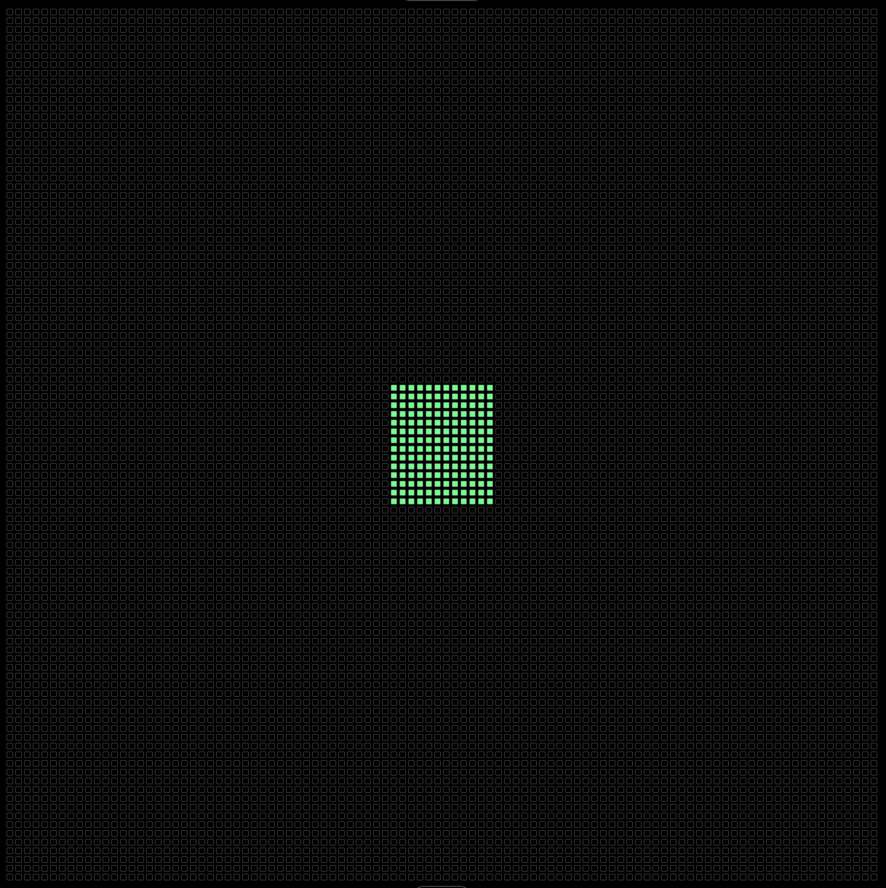
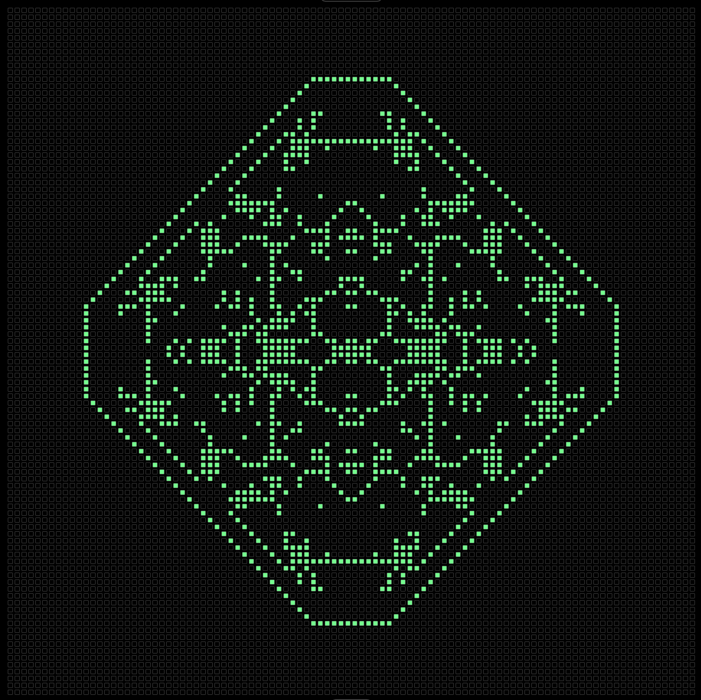
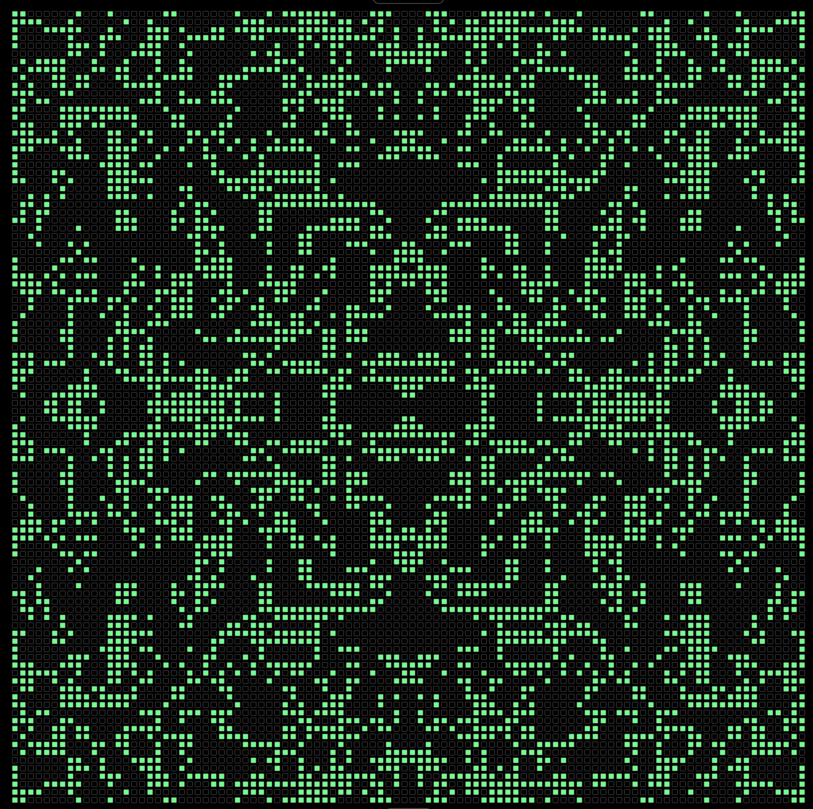

# game-of-life

## Table of Contents
[Project Link](#Link)  
[Technologies](#Technologies)  
[Description](#Description)  
[Screenshots](#Screenshots)  
[License](#License)  
[Contact](#Contact)

## Link
https://dalto135.github.io/game-of-life/

## Technologies
HTML, CSS and Javascript

## Description
A web app that simulates the Game of Life, an algorithm invented by John Horton Conway. Each square is in one of two states: "dead" or "alive". For any given square, whether it will be alive or dead in the next iteration depends on the number of it's adjacent squares that are alive. If a square is currently dead and it has exactly 3 adjacent squares that are alive, it will become alive in the next iteration. Otherwise, it will be dead the next iteration. If a square is currently alive and has exactly 2 or 3 adjacent squares alive, it will remain alive the next iteration. Otherwise, it will be dead the next iteration.

I currently have the program set so that 2 or 3 adjacent squares are needed to be alive regardless of whether the square is currently alive or dead, because this can be more fun to play with and observe. To watch the algorithm play out, click the button that says "Be". The program is still slow, so I've set it to jump to the next iteration every 10 seconds. You only need to click the top button once.

## Screenshots

## License
MIT

## Contact
Dalton Wilkins - daltongh@gmail.com